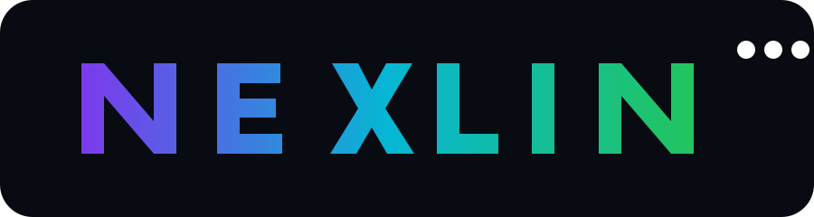
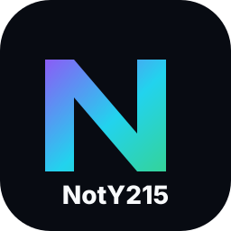

# NotY215

### Code. Create. Experiment. Repeat.

  
  
  

---

## $ whoami

I am **NotY215**, an independent developer who likes building things from the ground up.

My work moves between programming languages, compilers, backend systems, operating systems, AI-powered tools, game utilities, media tools, and creative software.

I prefer understanding how a system works internally instead of stopping at the surface.

~~~text
NotY215
├── Languages
│   └── Vayu
├── Compiler & Backend
│   └── VCB
├── Systems
│   └── NotYVOS
├── AI & Media
│   ├── NotY Caption
│   ├── NotY Upscaler
│   └── NotY VidGen
├── Game Tools
│   ├── NotY Game Repacker
│   ├── AutoTotem
│   └── HeartsPlugin
└── Experiments
    └── DXFS
~~~

---

## ⚡ What I Build

| Area | Work |
|---|---|
| 🧠 Language Design | **Vayu**, a Python-inspired native programming language |
| ⚙️ Compiler Engineering | **VCB**, Vayu's independent compiler backend |
| 🖥️ Operating Systems | **NotYVOS**, an x86-64 OS project with a PS3-compatible execution environment |
| 🤖 AI | Captioning, transcription, upscaling and media automation tools |
| 🎮 Game Development | Game packaging, Minecraft mods and game-related utilities |
| 🧰 Developer Tools | Compilers, formatters, language tooling and experimental utilities |
| 🎬 Creative Tools | Video, caption and media-processing software |
| 🧪 Experiments | Small systems and file-format experiments |

---

# 🚀 Main Projects

## 🌪️ Vayu

**Vayu** is my main programming-language project.

It is designed around:

- Python-inspired readable syntax
- Native compilation
- Static typing and type inference
- Low-level control
- C/C++ interoperability
- Python ecosystem interoperability
- GUI and application development
- Game and graphics development
- AI/ML ambitions
- Cross-platform development
- Dedicated package tooling
- Language Server, formatter and linter tooling

Vayu source files use **.vyu**.

### Vayu ecosystem

| Project | Purpose |
|---|---|
| **Vayu** | Compiler, runtime and language |
| **VCB** | Independent native compiler backend |
| **Vayu Website** | Documentation, roadmap and project information |
| **Vayu VS Code tooling** | Editor support, LSP, formatter and linter |

**Website:** https://vayu.gt.tc  
**Source:** https://github.com/NotY215/Vayu  
**Backend:** https://github.com/NotY215/VCB

---

## ⚙️ VCB

**VCB** stands for **Vayu Compiler Backend**.

It is a separate C++20 project intended to replace the QBE + GCC backend path with a direct native backend.

Current work includes:

- Textual SSA IR
- IR parser
- IR printer
- vcb dump
- x86-64 code generation
- PE writer
- ELF writer
- Native runtime integration

VCB is being developed separately from Vayu so the backend can evolve independently.

**Repository:** https://github.com/NotY215/VCB

---

## 🖥️ NotYVOS

**NotYVOS** is a lightweight x86-64 operating-system project.

The project combines:

- C++
- C
- x86-64 Assembly
- Clang/LLVM
- CMake
- Ninja
- Limine

A major part of the project is an integrated **PS3-compatible execution environment**.

**Repository:** https://github.com/NotY215/NotYVOS

---

# 🤖 AI & Media

## 🎬 NotY Caption Generator AI

An AI subtitle and caption generation tool built around Whisper, Spleeter and FFmpeg.

Features include:

- Whisper transcription
- Word-level timestamps
- Vocal separation
- YouTube input
- Multi-language transcription
- Translation mode
- Smart subtitle formatting
- Audio chunking
- Automatic cleanup
- Windows builds

**Repository:** https://github.com/NotY215/NotYCaptionGenAi-Light-weight

## 🖼️ NotY Upscaler ZAI

An AI-focused video/image upscaling project in the NotY tool ecosystem.

**Repository:** https://github.com/NotY215/NotYUpscalerZAI

## 🎞️ NotY Caption Official

The official NotY Caption project and its related application and website work.

**Repository:** https://github.com/NotY215/NotyCaption-Official

## 🎥 NotY VidGen

An experimental project focused on video generation workflows.

**Repository:** https://github.com/NotY215/NotYVidGen

---

# 🎮 Game & Minecraft Projects

## 📦 NotY Game Repacker

A Windows game packaging and repacking system using a custom **.noty** package format.

Technical focus:

- C++20
- Qt6
- CMake
- Zstandard
- AES-256-GCM
- BLAKE3
- Streaming operations
- Multi-threaded processing
- Installer and repacker applications

**Repository:** https://github.com/NotY215/NotYGameRepacker

## 🛡️ AutoTotem

A Fabric client-side Minecraft mod that automatically manages a Totem of Undying in the off-hand based on health.

**Repository:** https://github.com/NotY215/AutoTotem

## ❤️ HeartsPlugin

A Minecraft plugin project.

**Repository:** https://github.com/NotY215/HeartsPlugin

---

# 🧪 Smaller Projects & Experiments

## 🔢 DXFS

A C++17 digit-container file format and terminal editor.

DXFS explores compact representations for large digit sequences using packed data and generators.

**Repository:** https://github.com/NotY215/DXFS

---

# 🧰 Developer Toolbox

My projects often use or explore:

### Languages

C++ • C • Python • Java • Vayu • x86-64 Assembly

### Systems & Build

CMake • Ninja • LLVM • Clang • Git • GitHub

### AI & Media

Whisper • Spleeter • FFmpeg • Nuitka • PyInstaller

### Application & Game

Qt • Fabric • Minecraft • OpenGL • Windows

---

# 🎯 My Goals

### 01. Build Vayu into a complete language ecosystem

Not just a compiler.

The long-term direction includes:

- Native compiler
- Self-hosting
- Standard library
- Package ecosystem
- LSP
- Formatter
- Linter
- Debugging tools
- GUI stack
- Game-development stack
- AI/ML stack
- Graphics APIs
- Native interoperability
- Cross-platform tooling

### 02. Build VCB independently

VCB is intended to become a real native compiler backend instead of depending permanently on an external backend chain.

### 03. Learn systems by building systems

That includes:

- Compilers
- IRs
- Code generation
- Linkers
- Operating systems
- Runtime systems
- File formats
- Networking
- Graphics
- CPU architecture

### 04. Keep experimenting

Some projects are serious long-term systems.

Some are small experiments.

Both are useful.

---

# 📈 GitHub Activity

 

 

---

# htop Activity

~~~text
 NotY215 system monitor
 ─────────────────────────────────────────────────────────────

 PID   PROJECT              STATE       CPU     MEMORY
 001   Vayu                 BUILDING    ██████░  compiler
 002   VCB                  BUILDING    █████░░  backend
 003   NotYVOS              RUNNING     ████░░░  kernel
 004   NotY Caption         ACTIVE      ███░░░░  AI/media
 005   NotY Game Repacker   ACTIVE      ██░░░░░  tooling
 006   AutoTotem            ACTIVE      ██░░░░░  Minecraft
 007   DXFS                 EXPERIMENT   █░░░░░░  research

 STATUS: building
 FOCUS: languages • compilers • systems • tools
~~~

---

# 🧭 Current Direction

~~~text
Vayu
 │
 ├── Language
 │    ├── Syntax
 │    ├── Types
 │    ├── Runtime
 │    └── Tooling
 │
 ├── VCB
 │    ├── IR
 │    ├── x86-64
 │    ├── PE
 │    └── ELF
 │
 └── Ecosystem
      ├── Packages
      ├── LSP
      ├── Formatter
      ├── Linter
      └── Native tooling

NotYVOS
 └── x86-64 OS
      └── PS3-compatible execution environment
~~~

---

# 🎨 Outside Code

I also work with:

- 🎬 Video editing
- 🎞️ Anime edits
- 🖼️ Visual design
- 🎮 Gaming
- 🧩 Game development
- 🧪 Technical experimentation

Code is the main focus, but creative work is part of the same workflow.

---

# 📚 How I Learn

I learn by building.

Instead of only reading about a compiler, I build one.

Instead of only reading about an OS, I build one.

Instead of only reading about an IR, I design one.

The projects are the learning process.

~~~text
Question
   ↓
Research
   ↓
Prototype
   ↓
Break it
   ↓
Understand why
   ↓
Rebuild it
   ↓
Keep going
~~~

---

# 🔭 Long-Term

The bigger goal is not one application.

It is a connected ecosystem of software built from the ground up.

~~~text
Language
   ↓
Compiler
   ↓
Backend
   ↓
Runtime
   ↓
Tools
   ↓
Applications
   ↓
Systems
~~~

Vayu is the center of that direction, while the other projects let me explore different layers of software engineering.

---

# 🔗 Find Me

  <a href="https://github.com/NotY215">GitHub</a> •
  <a href="https://vayu.gt.tc">Vayu</a> •
  <a href="https://www.youtube.com/@NotY215">YouTube</a> •
  <a href="https://t.me/Noty_215">Telegram</a>

---

### NotY215

**Independent developer • Editor • Gamer • Programmer • Game developer**

